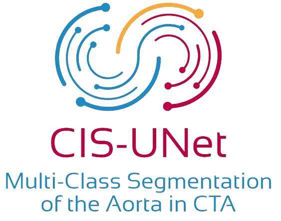
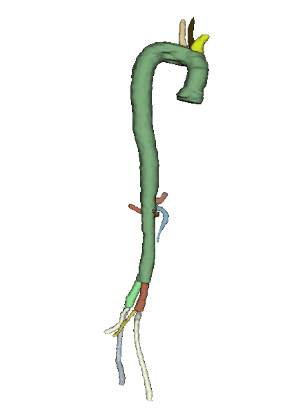
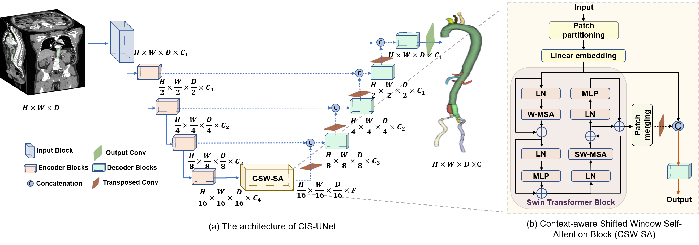
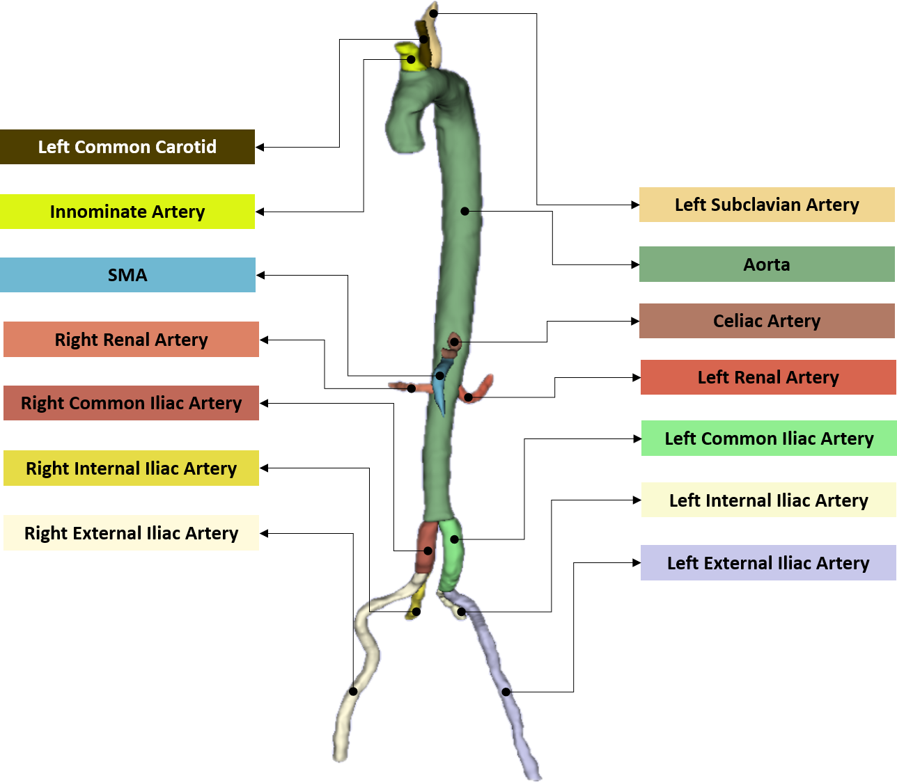

<div align=center> <h1>
  
  CIS-UNet: Multi-Class Segmentation of the Aorta in  Computed Tomography Angiography via Context-Aware Shifted Window Self-Attention</h1>

Welcome to the repository containing the code and dataset for **CIS-UNet**, a deep learning model designed for accurate 3D segmentation of the aorta and its branches.
  
[](https://github.com/ImranNust) &emsp;
[](https://surgery.med.ufl.edu/profile/krebs-jonathan/) &emsp;
[](https://www.linkedin.com/in/veera-rajasekhar-reddy-gopu-3107361a6/?originalSubdomain=in) &emsp;
[](https://surgery.med.ufl.edu/profile/fazzone-brian/) &emsp;
[](https://github.com/VishalBalajiSivaraman) &emsp;
[](https://www.linkedin.com/in/amar-ufl/) &emsp;
[](https://surgery.med.ufl.edu/profile/viscardi-chelsea/) &emsp;
[](https://www.orlandohealth.com/physician-finder/robert-e-heithaus-md#/overview) &emsp;
[](https://www.linkedin.com/in/benjamin-shickel-804976ab/) &emsp;
[](https://yuyinzhou.github.io/) &emsp;
[](https://surgery.med.ufl.edu/profile/cooper-michol/) &emsp;
[](https://www.linkedin.com/in/wei-shao-438782115/)

</div>

---

## Repository Contents



1. [Overview](#overview)
2. [Directory Structure](#directory-structure)
3. [Dataset Detail](#dataset-detail)
4. [Scripted Code](#scripted)
    1. [Training From The Shell](#shell_training)
    2. [Prediction and Evaluation From the Shell](#shell_prediction)
6. [Interactive Code](#interactive)
    1. [Training Using Jupyter Notebook](#jupyter_training)
    2. [Prediction and Evaluation Using Jupyter Notebook](#jupyter_prediction)
7. [Dependencies](#dependencies)
8. [Citations](#citations)


## Overview <a id="overview"></a>

<div align=justify>
Aortic segmentation is crucial for minimally invasive treatments of aortic diseases.  Inaccurate segmentation can lead to errors in surgical planning and endograft construction. Previous methods treated aortic segmentation as a binary image segmentation problem, neglecting the need to distinguish individual aortic branches.

CIS-UNet addresses this limitation by performing multi-class segmentation of the aorta and thirteen aortic branches. It combines the strengths of convolutional neural networks (CNNs) and Swin transformers, resulting in a hierarchical encoder-decoder architecture with skip connections. Notably, CIS-UNet introduces a novel Context-aware Shifted Window Self-Attention (CSW-SA) block that enhances feature representation by capturing long-range dependencies between pixels.
</div>
<div align=center>

</div>

## Directory Structure <a id="directory-structure"></a>

<h3> 1. Clone the Repository:</h3>

  Open your terminal or command prompt and clone the project directory as follows:
  ```
  git clone https://github.com/mirthAI/CIS-UNet.git
  ```

<h3> 2. Navigate to the Directory: </h3>

  Once the repository is cloned, navigate to the desired directory using the `cd` command as follows:
  ```
  cd CIS-UNet
  ```
<h3> 3. Directory Structure of CIS-UNet </h3>


```
CIS-UNet/
├── data/                                        # Folder containing the data
|     ├── Volumes/
|     │     ├── Subject001_CTA.nii.gz            # Input CTA image
|     │     ├── Subject002_CTA.nii.gz            # Input CTA image
|     │     │     
|     │     └── ...                              #(similar structure for other data samples)
|     |
|     └── Labels/
|           ├── Subject001_CTA_Label.nii.gz      # Input Segmentation
|           ├── Subject002_CTA_Label.nii.gz      # Input Segmentation
|           |
|           └── ...                              # (similar structure for other data samples)  
│
├── InteractiveCodes/                            # Folder containing the Jupyternotebooks
│      ├── Training.ipynb                        # Jupyter notebook containing the script for executing the training of the model.
|      ├── Prediction_and_Evaluation.ipynb       # Jupyter notebook containing the code to generate segmentation files using the trained models and to produce the metrics (DCS and MSD)
|      ├── utils/                                # Folder containing utility functions used during training
|      |     ├── init.py                         # Empty file to mark utils as a Python package
|      |     ├── CIS_UNet.py                     # CIS_UNet model definition
|      |     ├── dataset_processor.py            # Python script containing functions for loading and processing data
|      |     └── training_validation.py          # Python script containing functions for training the model
|      ├── results                               # The directory where the segmenation files and the computed metrics will be saved.
|      └── saved_models                          # The directory where your best trained models for each fold will be saved.
│
└── ScriptedCodes/                               # Folder for scripted code
       ├── run_training.sh                       # Bash script to execute training process
       ├── segmentation_pipeline.py              # Python script containing the core training logic
       ├── predict_and_evaluate.py               # Python script to generate segmentation files using the trained models and to produce the metrics (DCS and MSD)
       ├── run_prediction_and_evaluation.sh      # Bash script to execute prediction and evaluation processes
       ├── utils/                                # Folder containing utility functions used during training
       |     ├── init.py                         # Empty file to mark utils as a Python package
       |     ├── CIS_UNet.py                     # CIS_UNet model definition
       |     ├── dataset_processor.py            # Python script containing functions for loading and processing data
       |     └── training_validation.py          # Python script containing functions for training the model
       ├── results                               # The directory where the segmenation files and the computed metrics will be saved.
       └── saved_models                          # The directory where your best trained models for each fold will be saved.                                                 

```
---

## Dataset Detail <a id="dataset-detail"></a>

<div align=justify>


  
**Our dataset consists of 59 CTA images**, each with an axial size of **512×512 pixels** and an isotropic in-plane resolution ranging from **0.759 mm to 1.007 mm**, with an average of **0.875 mm**. The number of axial slices varies between **347 and 962**, with a mean of **734 slices**. The axial slice thickness ranges from **0.8 mm to 2 mm**, averaging **0.969 mm**. 

In addition to the imaging data, our dataset includes 59 3D scorresponding egmentation volumes, containing the **annotations for thirteen vascular branches**. These branches include the Aorta, Innominate Artery (IA), Right Subclavian Artery, Right Common Carotid Artery, Left Common Carotid Artery (LCC), Left Subclavian Artery (LSA), Celiac Artery (CA), Superior Mesenteric Artery (SMA), Left Renal Artery (LRA), Right Renal Artery (RRA), Left Common Iliac Artery (LCIA), Left External Iliac Artery (LEIA), Left Internal Iliac Artery (LIIA), Right Common Iliac Artery (RCIA), Right External Iliac Artery (REIA), and Right Internal Iliac Artery (RIIA).


To expedite model training, we resampled the volumes to a uniform spacing of **1.5 mm×1.5 mm×1.5 mm**. We used the **"[RandCropByPosNegLabeld](https://docs.monai.io/en/stable/transforms.html)" function from the [MONAI](https://monai.io/) library** to facilitate random cropping of a fixed-size region from a large 3D image. The cropping center can be either a foreground or background voxel, determined by a specified foreground-to-background ratio. By leveraging this function, we selected random **128×128×28 patches** from the resampled volumes for training, enhancing data diversity and mitigating overfitting.


<h3>Accessing the Dataset</h3>

A dataset containing 59 3D CTA volumes along with segmentation files is available. To access the dataset, please click [here](https://na3.docusign.net/Member/PowerFormSigning.aspx?PowerFormId=44c40604-8324-4afe-ba5a-083d27d46550&env=na3&acct=38f380cc-7bc9-468e-9c99-fc5ba7151d54&v=2) and complete the data agreement form.


</div>

---


<div align=center> <h1> 
  <a id="scripted"></a>
  Scipted Code
</h1></div>

For those who prefer running scripts from the shell, follow these steps to train the model:

<h3> Training From the Shell </h3>


1. **Create an Environment:** Create a new virtual environment using `conda`.
   ```bash
   conda create --name CIS_UNet python=3.10
   ```
2. **Activate the Enviornment:** Activate the newly created environment.
   ```bash
   conda activate CIS_UNet
   ```
3. **Install Required Packages:** Install the necessary packages listed in the **[requirements.txt](https://github.com/mirthAI/CIS-UNet/blob/main/requirements.txt)** file.
   ```bash
   pip install -r requirements.txt
   ```
4. **Train the CIS_UNet Network:** <a id="shell_training"></a>
   - Confirm that your current working directory is `ScriptedCodes`. If not, navigate to the directory where the script is saved:
     ```bash
     cd ScriptedCodes
     ```
   - To initiate the training process for all four folds, execute the following commands:
        ```bash
        chmod +x ./run_training.sh
        ./run_training.sh
        ```
   - The script will automatically create a `saved_model` folder within the `ScriptedCodes` directory.
   - The training process will proceed, and the model achieving the lowest loss will be stored in the `saved_model` directory.
   
5. **Prediction and Evaluation:** <a id="shell_prediction"></a> After training, use the saved checkpoints to generate predictions on the test set and evaluate the model. 
   - Verify that you are located within the `ScriptedCodes` directory.
   - Execute the following commands to commence the prediction and evaluation process:

     ```bash
     chmod +x ./run_prediction_and_evaluation.sh 
     ./run_prediction_and_evaluation.sh 
     ```
   - Upon successful execution, the `results` directory will be populated with the original segmentation files, predicted segmentation files, and the original CTA volumes for all folds.
   - Concurrently, a comprehensive CSV file detailing the evaluation metrics will be generated. This file includes the **Dice Coefficient** and **Mean Surface Distance**.

---

<div align="center">
  <a id="interactive"></a>
  <h1>Interactive Code</h1>
</div>

For those who prefer Jupyter notebooks, navigate to the `InteractiveCodes` directory, where you will find two notebooks:

1. **1_Training.ipynb**
2. **2_Prediction_and_Evaluation.ipynb**


### Steps:

1. **Training CIS UNet Using Jupyter Notebook:** <a id="jupyter_training"></a>
   - Open `1_Training.ipynb` and run it. This self-explanatory notebook will guide you through all the steps to train the network.
   - It will run the training for all the folds and save the best trained models in the `saved_models` directory.


2. **Prediction and Evaluation:**  <a id="jupyter_prediction"></a>
   - Open `2_Prediction_and_Evaluation.ipynb` and run it. This notebook will guide you through the steps for prediction and generating evaluation metrics.
   - This process will generate 3D segmentation files in the `results` directory. Additionally, a CSV file will be generated containing the **Dice coefficient** and **Mean Surface Distance**.

Feel free to experiment and improve upon our results.

---

## Dependencies <a id="dependencies"></a>

The following dependencies are required for the project:

<div align=center>

[](https://www.python.org/downloads/release/python-31014/) &emsp;
[](https://numpy.org/devdocs/release/1.26.4-notes.html) &emsp;
[](https://docs.monai.io/en/stable/) &emsp;
[](https://pytorch.org/get-started/pytorch-2.0/) &emsp;
[](https://pypi.org/project/SimpleITK/) &emsp;
[](https://scikit-learn.org/stable/whats_new/v1.5.html) &emsp;
 &emsp;
 &emsp;
 &emsp;
 &emsp;
 &emsp;
 &emsp;
[](https://pypi.org/project/seg-metrics/)


</div>

## Citations <a id="citations"></a>

**If you utilize our code or dataset in your research, we kindly ask you to acknowledge our work by citing the following publications:**
```bibtex
1. @article{IMRAN2024102470,
    title = {CIS-UNet: Multi-class segmentation of the aorta in computed tomography angiography via context-aware shifted window self-attention},
    author = {Muhammad Imran and Jonathan R. Krebs and Veera Rajasekhar Reddy Gopu and Brian Fazzone and Vishal Balaji Sivaraman and Amarjeet Kumar and Chelsea Viscardi and Robert Evans Heithaus and Benjamin Shickel and Yuyin Zhou and Michol A. Cooper and Wei Shao},
    journal = {Computerized Medical Imaging and Graphics},
    volume = {118},
    pages = {102470},
    year = {2024},
    issn = {0895-6111},
    doi = {https://doi.org/10.1016/j.compmedimag.2024.102470},
    url = {https://www.sciencedirect.com/science/article/pii/S0895611124001472}}

2. @article{KREBS20241025,
    title = {Volumetric analysis of acute uncomplicated type B aortic dissection using an automated deep learning aortic zone segmentation model},
    author = {Jonathan R. Krebs and Muhammad Imran and Brian Fazzone and Chelsea Viscardi and Benjamin Berwick and Griffin Stinson and Evans Heithaus and Gilbert R. Upchurch and Wei Shao and Michol A. Cooper},
    journal = {Journal of Vascular Surgery},
    volume = {80},
    number = {4},
    pages = {1025-1034.e4},
    year = {2024},
    issn = {0741-5214},
    doi = {https://doi.org/10.1016/j.jvs.2024.06.001},
    url = {https://www.sciencedirect.com/science/article/pii/S074152142401245X}}

3. @article{IMRAN2025AORTASEG24,
    title={Multi-Class Segmentation of Aortic Branches and Zones in Computed Tomography Angiography: The AortaSeg24 Challenge},
    author={Muhammad Imran and  Jonathan R Krebs and Vishal Balaji Sivaraman and Teng Zhang and ... and Jun Ma and Yuyin Zhou and Michol A. Cooper and Wei Shao},
    journal={arXiv preprint arXiv:2502.05330},
    year={2025},
    url = {https://arxiv.org/abs/2502.05330}}

